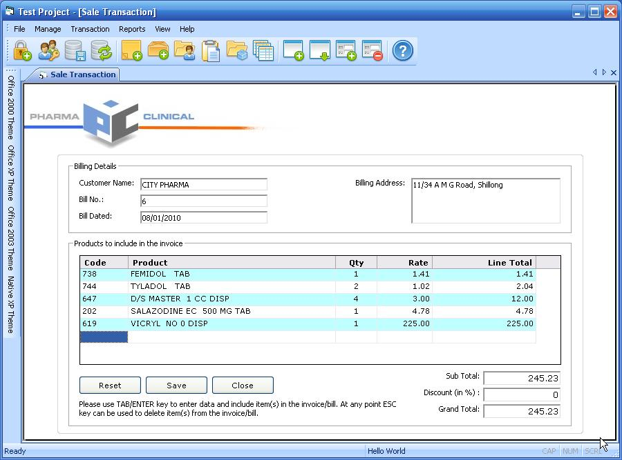



## Students Information Management

### Description

This code shows how to use ADO with Visual Basic 6 to generate a nice user friendly application. The backend database used is in MS Access.
 
### More Info
 
first downoload two ActiveX controls from PSC to run this application. I have downloaded these from PSC and used in this project. Read the included important readme file first.

             |
---                |---
**Submitted On**   |2009-12-13 11:59:36
**By**             |[bhuttu](https://github.com/Planet-Source-Code/PSCIndex/blob/master/ByAuthor/bhuttu.md)
**Level**          |Intermediate
**User Rating**    |3.2 (19 globes from 6 users)
**Compatibility**  |VB 6\.0
**Category**       |[Databases/ Data Access/ DAO/ ADO](https://github.com/Planet-Source-Code/PSCIndex/blob/master/ByCategory/databases-data-access-dao-ado__1-6.md)
**World**          |[Visual Basic](https://github.com/Planet-Source-Code/PSCIndex/blob/master/ByWorld/visual-basic.md)
**Archive File**   |[Students\_I217226192010\.zip](https://github.com/Planet-Source-Code/bhuttu-students-information-management__1-72812/archive/master.zip)

